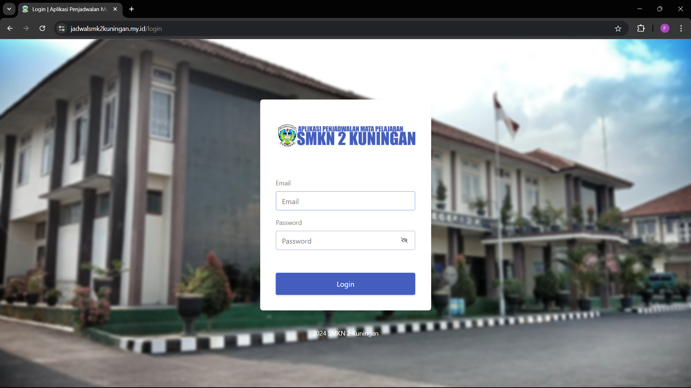
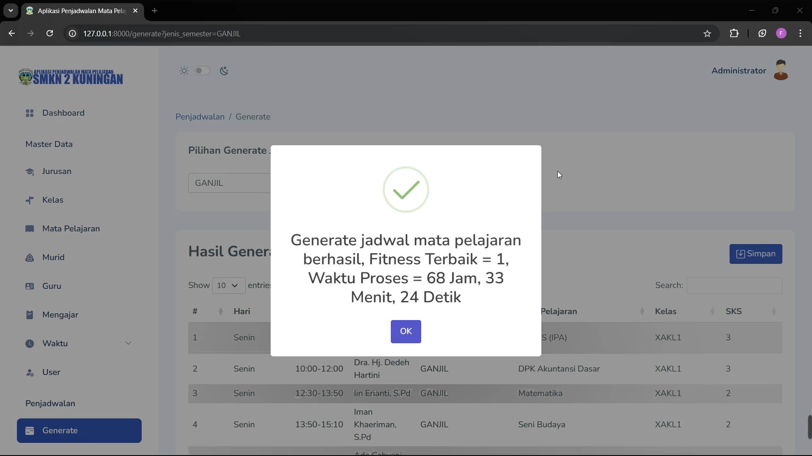
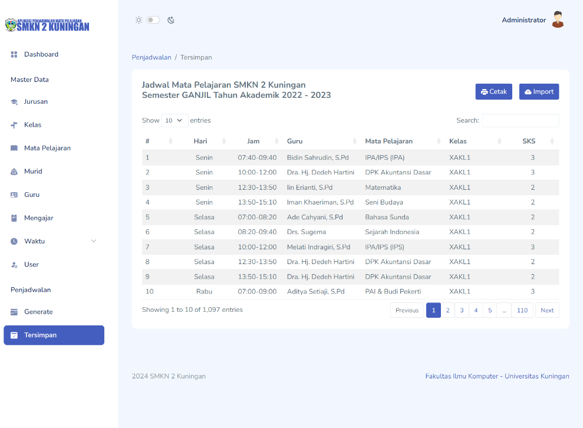

<p align="center">
  
</p>

<h1 align="center">
APLIKASI PENJADWALAN MATA PELAJARAN  
MENGGUNAKAN ALGORITMA GENETIKA  
BERBASIS WEB
</h1>

<p align="center">
  <b>Project Tugas Akhir / Skripsi</b><br>
  Sistem Informasi Penjadwalan Sekolah
</p>

---

## 📌 Deskripsi Singkat
Aplikasi ini merupakan sistem penjadwalan mata pelajaran berbasis web yang dibangun menggunakan **Laravel Framework** dan menerapkan **Algoritma Genetika** untuk menghasilkan jadwal pelajaran yang optimal, efisien, dan minim konflik.

Aplikasi ini ditujukan untuk membantu pihak sekolah dalam menyusun jadwal pelajaran secara otomatis dengan mempertimbangkan berbagai constraint seperti:
- Guru
- Mata pelajaran
- Kelas
- Waktu

---

## 🚀 Fitur Utama
- Manajemen data guru
- Manajemen mata pelajaran
- Manajemen kelas
- Proses generate jadwal menggunakan Algoritma Genetika
- Visualisasi jadwal pelajaran
- Import dan Export Excel
- Login & autentikasi pengguna
- Hak akses admin dan murid

---

## 🧬 Algoritma yang Digunakan
Aplikasi ini menggunakan **Algoritma Genetika (Genetic Algorithm)** dengan tahapan:
1. Inisialisasi populasi
2. Evaluasi fitness
3. Seleksi
4. Crossover
5. Mutasi

Algoritma ini digunakan untuk meminimalkan bentrok jadwal dan menghasilkan solusi terbaik.

---

## 🛠️ Teknologi yang Digunakan
- **Laravel** (Backend Framework)
- **PHP**
- **MySQL**
- **Bootstrap**
- **JavaScript**

---

## 📷 Tampilan Aplikasi

### 🔐 Halaman Login


### ⚙️ Generate Jadwal



### 📅 Jadwal Pelajaran



---

## ⚙️ Cara Instalasi
1. Clone repository:
   ```bash
   git clone https://github.com/USERNAME/APLIKASI-PENJADWALAN-MATA-PELAJARAN-MENGGUNAKAN-ALGORITMA-GENETIKA-BERBASIS-WEB.git
